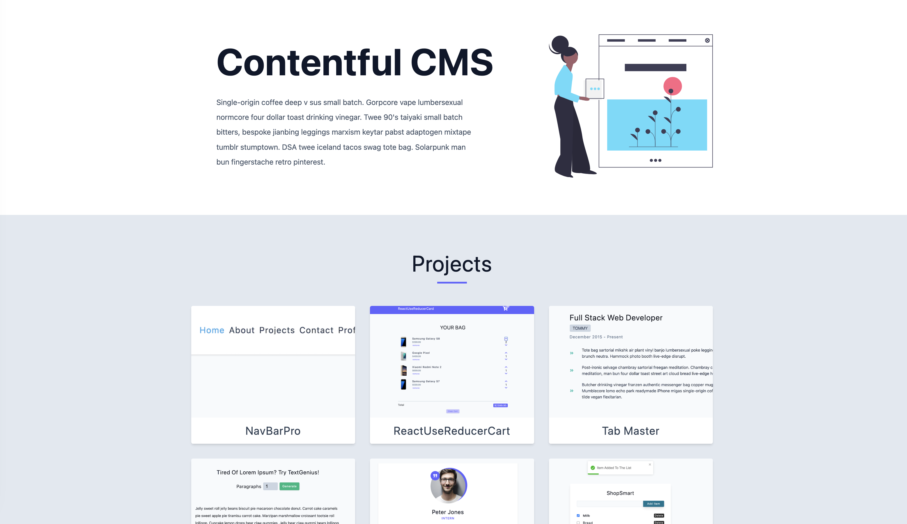

## Contentful CMS

This React project leverages `Contentful` as a headless CMS to efficiently store and manage images for a curated selection of projects. With an intuitive interface provided by Contentful, content creators can seamlessly add, update, and organize their images. By using the `Contentful API`, developers can access content and obtain the essential Space ID and Access Token for programmatic content interactions.

## Tech Stack
- `JavaScript`: The foundational programming language for creating responsive and interactive features.
- `React`: The powerful JavaScript library used to build the project: 
- - `useState` The React hook used to manage state.
- - `useEffect`The React hook used to handle side effects.
- `Contentful`: The headless CMS used for content creation and management.

### Explore The Website
[Contentful CMS on Netlify](https://contentful-hub.netlify.app/)

### Preview

